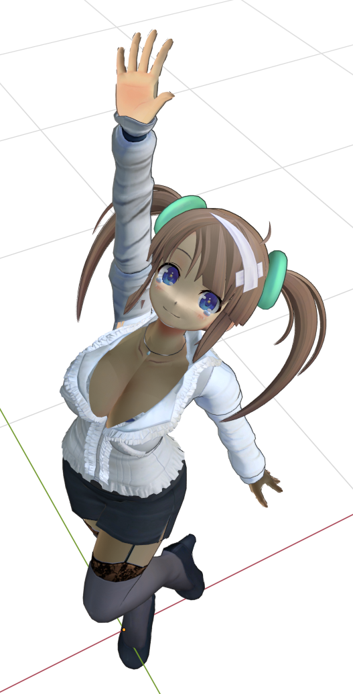
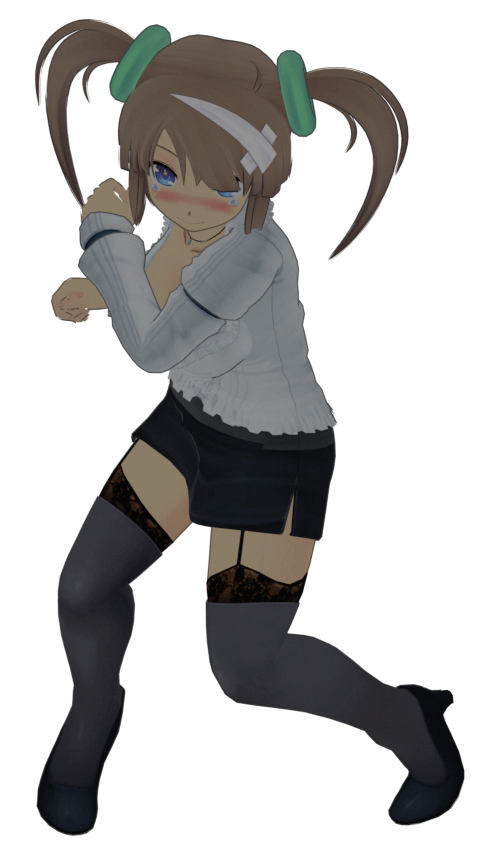
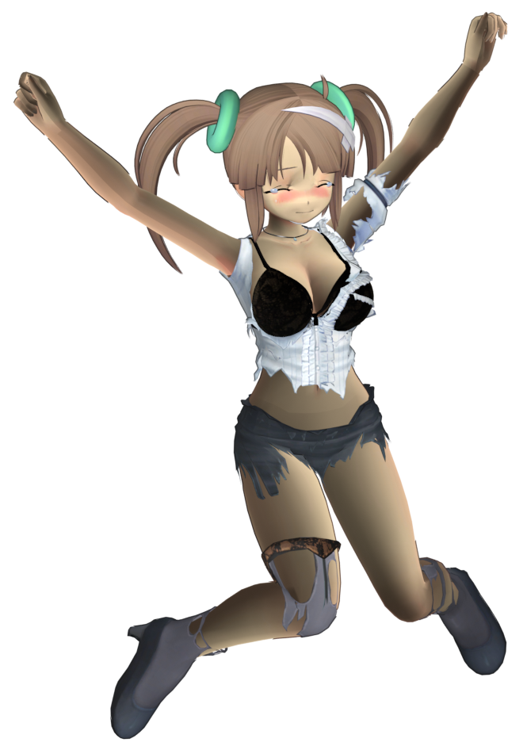

# cat2blend
Imports Tamsoft models into blender

Testing on Senran Kagura Estival Versus models

Most parts was reversed by my self

Some parts was adviced by [Random Talking Bush](https://www.vg-resource.com/thread-29836.html). Thx bro, you saves bones tips

I'm using linux, so modify windows paths by your self. Sory win guys

#### whats works:
- cat file parser
- mesh parser (with bones)
- texture parser
- animations
#### whats in plan:
- armatures merging (when you customize your character)

#### how to use
1. open scripting tab
2. in any text windows select script choose "open_model_with.."
3. play this script
4. select any file with model or animation
    
#### how to load character poperly
Every actor got two types of meshes lower armateured and polygoned (_L) and higher (_H).
Also there are two types of actions. For H and L armatures. 
_hr action is for hair, _wpn is for weapon, _hd is for face mimic.
You you need to set same action with different suffix to different body parts

There is an some of order
- load some buras (texture only)
- load face
- load hair
    - in hair aramture object set face armature as a parent
- load body
    - select another body's texture skin_*** (it loads with face)
    - hide unwanted cloth meshes
    - add second material 'outline**skin' to every skin body parts (if you want toon like outlines to body)
- load pantsu
    - change pants armature object parent a body armature (no bone) OR
    - swap pants object parent to an body armature (pants armature remove)
    - hide unwanted pants meshes
- rotate face armature to x = -90
- in face armature add constrain 'child of'
    - set constraint boject to armature and bone to 'head'
- select armature and set its action
- joy

#### how to reset characher pose
sometimes some pose can overlap some another pose. Looks creepy
better way to reset pose
1. choose bones to reset
2. set pose mode
3. select all bones (A)
4. reset pose, rotation, scale (ALT+G, ALT+R, ALT+S)

